# DbQuest ERP System

**DbQuest** is an internal ERP system built for company employees to manage their daily tasks, project tracking, and time management efficiently. It offers a simple, interactive interface backed by powerful features for productivity and reporting.

---

## ✨ Features

- 📋 **Daily Work Management**  
  Employees can log and view their day-to-day tasks using a worksheet-like interface.

- 📁 **Project Task Assignment & Tracking**  
  Assign, update, and accept project-specific tasks with real-time visibility into task status.

- 📊 **Time Tracking Visualization**  
  The home dashboard displays a bar graph of time spent on each project. Clicking on a project reveals all related tasks.

- 🛫 **Leave Request System**  
  Employees can request and accept/reject leaves from within the app.

- 👥 **Customer Management**  
  View and manage customer-related details tied to tasks or projects.

- 📍 **Location-Based Attendance**  
  Attendance (In-Time and Out-Time) is marked only when the employee is physically near the office, verified through GPS.

- 📅 **Worksheet & Attendance Sorting**  
  Employees and admins can view worksheets and attendance records, filtered by employee and month/year for better analysis.

---

## 🖼️ Screenshots

### Login Page
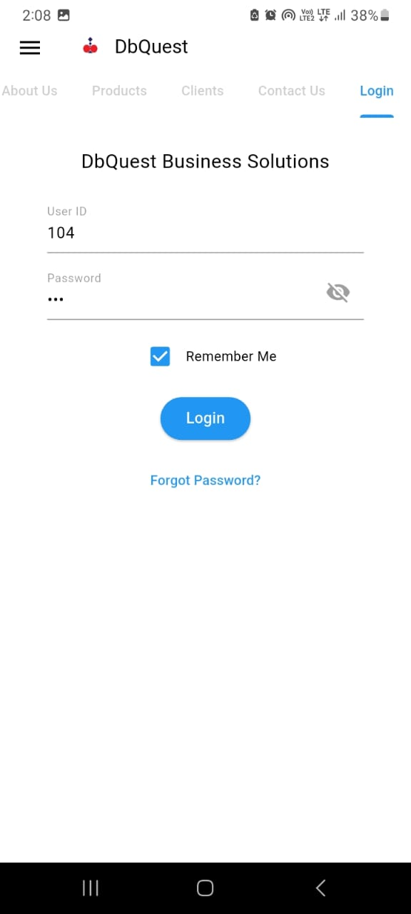

### Main Page Sidebar
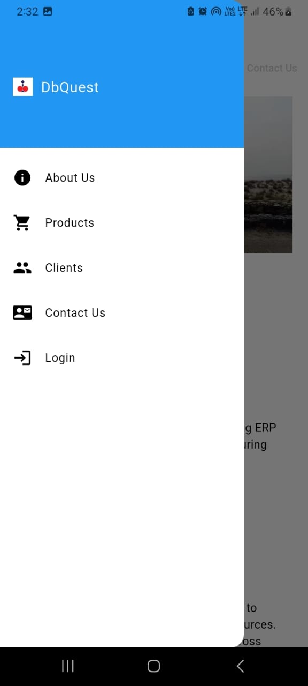

### Bar Chart – Displays No. of Hours Worked Per Project
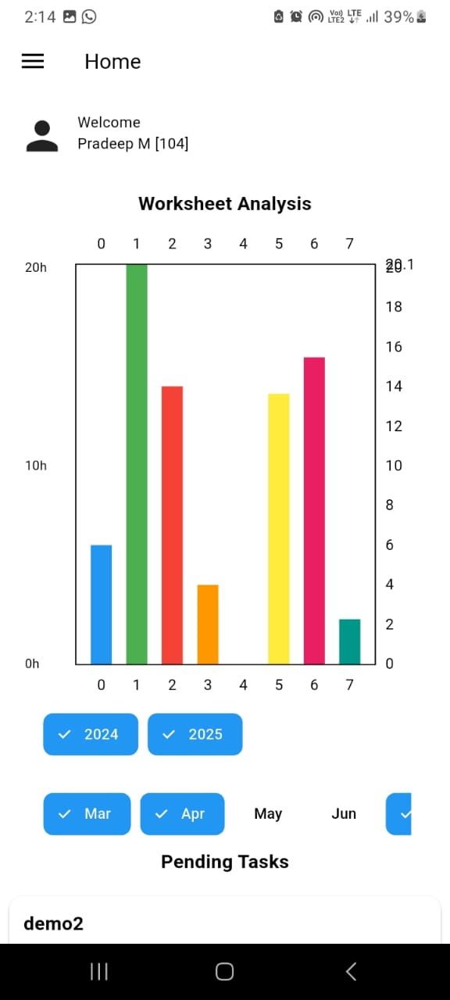

### Tasks Done in Selected Project
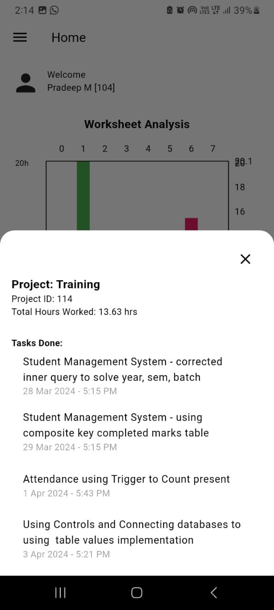

### Home Page Navigation Drawer
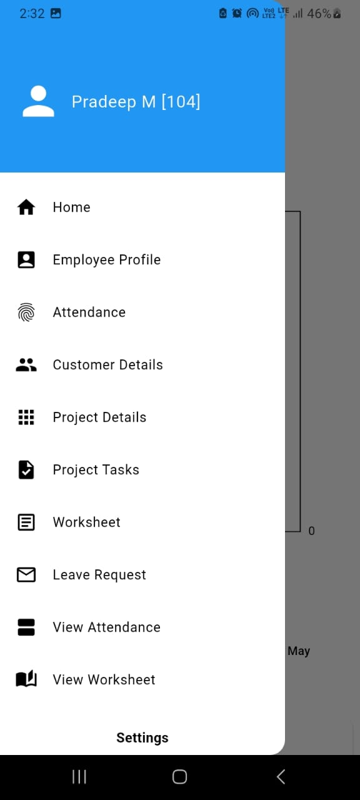

### Employee Profile
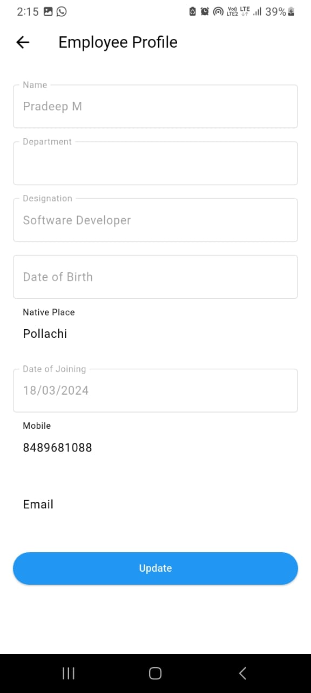

### Attendance Page
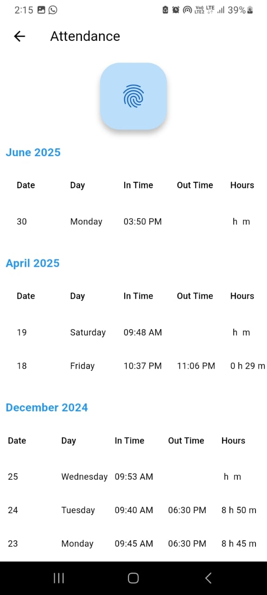

### Customer Details
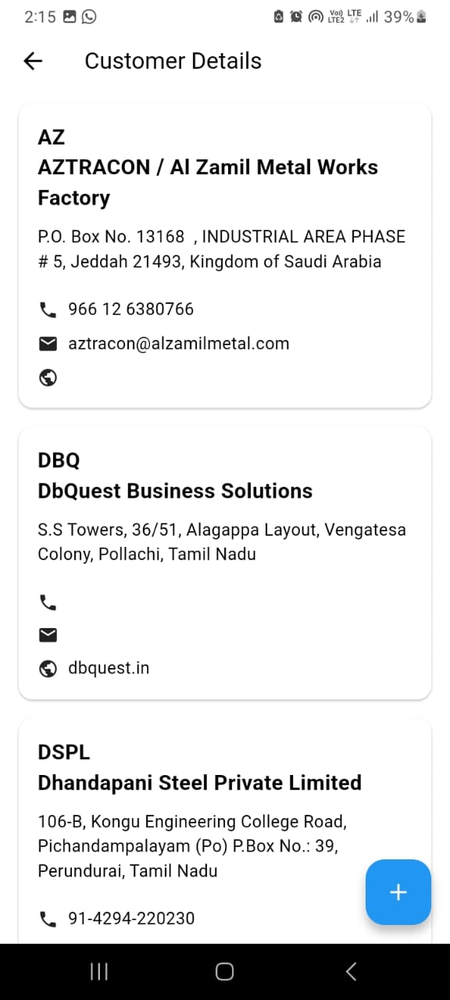

### Project Task View
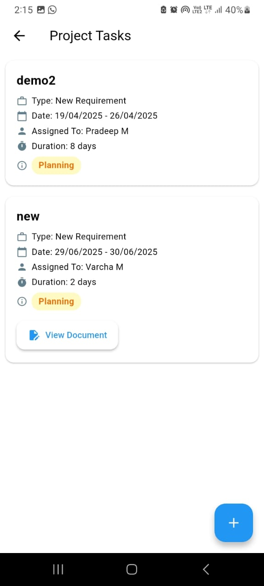

### Worksheet Details
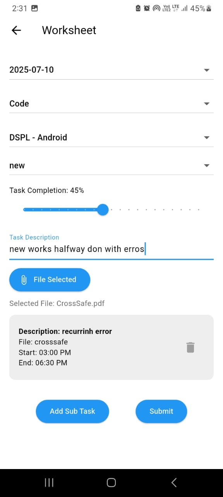

### View Attendance
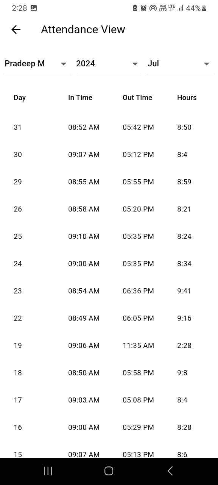

### View Worksheet
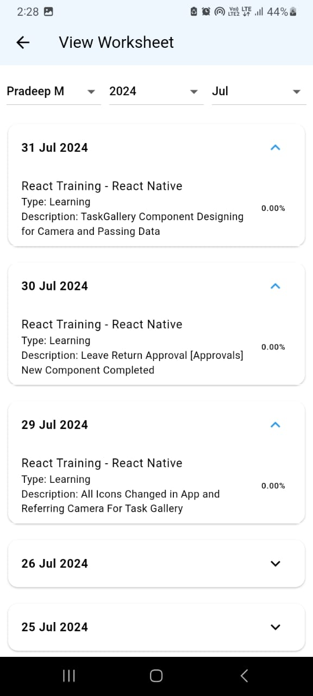

### Add Leave Request
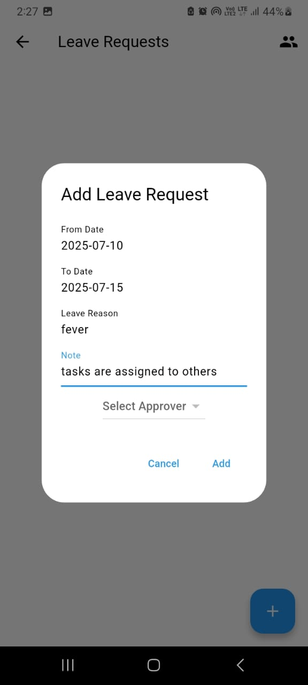

### Change Password
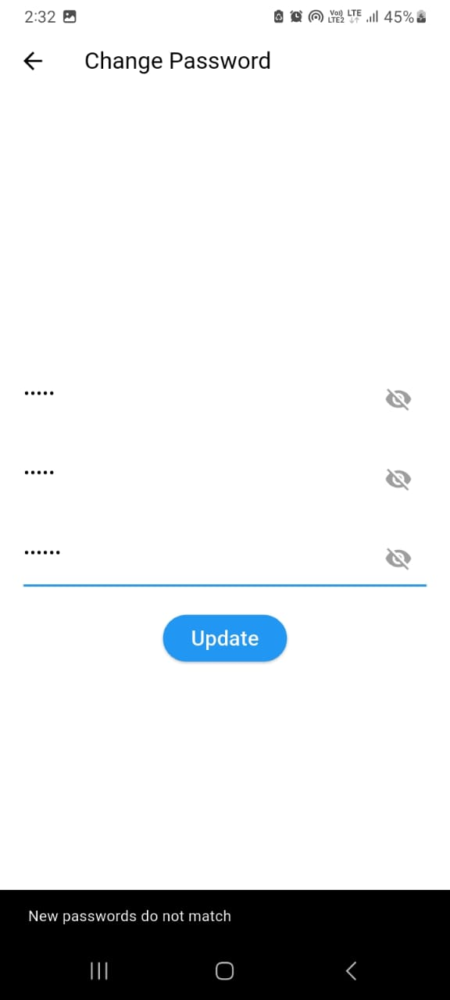

### Logout Confirmation
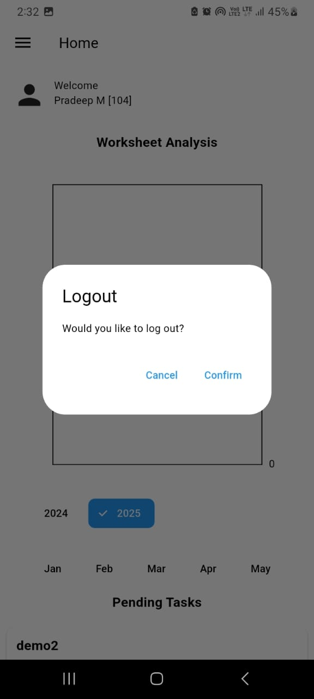

---

## 🛠 Tech Stack

- 💙 **Frontend:** Flutter  
- ☕ **Backend:** Spring Boot  
- 🗄️ **Database:** SQL Server

---

## 📁 Project Structure

DbQuest/

├── frontend/ # Flutter mobile app

├── backend/ # Spring Boot backend

└── README.md

---

## 🔒 Security Notice

> The following files are excluded from version control via `.gitignore` to protect sensitive data:
> 
> - `application.properties`
> - `system.properties`
> - `firebase-service-account.json`

---

## 📌 Project Status

🚧 *Work in Progress* — actively being developed and deployed for internal use at **DbQuest**.

---

## 👩‍💻 Author

**Varsha Muthusami**  
Developer and Project Owner

## License
This project is licensed under the Apache License 2.0 — see the [LICENSE](./LICENSE) file for details.
© 2025 Varsha Muthusami

